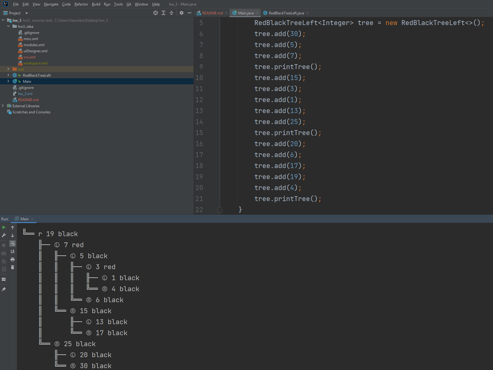

# Урок 4. Структуры данных дерево и хэш-таблица
Необходимо превратить собранное на семинаре дерево 
поиска в полноценное левостороннее красно-черное дерево. 
И реализовать в нем метод добавления новых элементов с балансировкой.

Красно-черное дерево имеет следующие критерии:

• Каждая нода имеет цвет (красный или черный)

• Корень дерева всегда черный

• Новая нода всегда красная

• Красные ноды могут быть только левым ребенком

• У краной ноды все дети черного цвета

Соответственно, чтобы данные условия выполнялись, 
после добавления элемента в дерево необходимо произвести балансировку, 
благодаря которой все критерии выше станут валидными. 
Для балансировки существует 3 операции:

- левый малый поворот, метод *rotateLeft*;
- правый малый поворот, метод *rotateRight* 
- смена цвета, метод *swapColor*.

## Результат выполнения

Для вывода дерева в консоль реализована рекурсивная функция *printTree*.

Результат выглядит следующим образом

